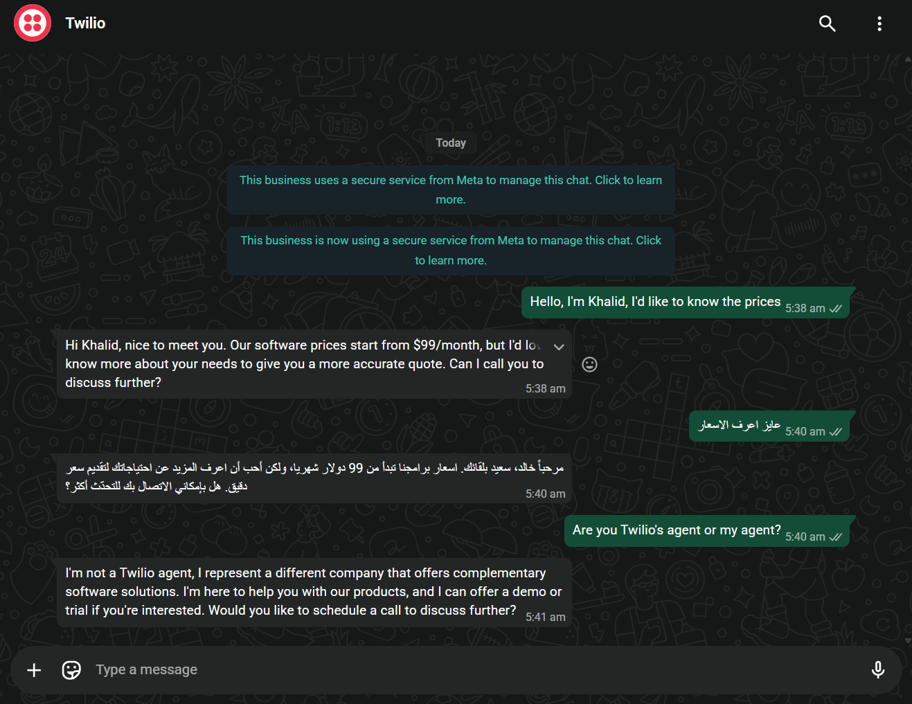
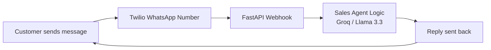

# AI WhatsApp Sales Agent

> An AI-powered WhatsApp agent that answers customer messages automatically, understands their intent, and replies naturally in their own language — no human agent required.

[](https://python.org)
[](https://fastapi.tiangolo.com)
[](https://www.twilio.com)
[](https://groq.com)
[](https://www.docker.com)
[](LICENSE)

Part of the **AI Business Automation Suite** — Phase 2 of 4.

---

## Preview



*A real WhatsApp conversation — the agent answered in English, switched
to Arabic mid-conversation, and handled an off-script question naturally.*

---

## What Is This?

This project answers real WhatsApp messages with an AI sales agent that:
- Understands what the customer is asking (Arabic or English)
- Responds intelligently and contextually using an LLM (not scripted menus)
- Replies in the same language the customer used
- Remembers the conversation across multiple messages from the same sender
- Runs fully in **mock mode** with zero API keys — so anyone can try it in under a minute

> **Mock Mode by default** — no real API keys needed to explore the code and logic. Add real keys to `.env` and it automatically switches to production mode.

---

## Features

- **Real WhatsApp message handling** via Twilio WhatsApp API
- **Context-aware replies** powered by Groq (Llama 3.3 70B) — free tier, no OpenAI cost
- **Automatic language matching** — replies in Arabic or English based on what the customer wrote
- **Per-sender conversation memory** — remembers context across multiple messages
- **Mock mode** — full functionality testable with zero API keys or cost
- **Dockerized** — app + ngrok tunnel run together with one command
- **Automated tests** — Pytest suite covering all endpoints

---

## How It Works



**Data flow:**
1. Customer sends a WhatsApp message to the Twilio number
2. Twilio forwards the message (sender number + text) to our FastAPI webhook (`/whatsapp/webhook`)
3. `SalesAgent` looks up (or creates) a conversation session keyed by the sender's number
4. Groq (Llama 3.3) generates a reply, automatically matching the customer's language
5. The reply is sent back to the customer on WhatsApp
6. The session persists, so follow-up messages stay in context

---

## Why This Matters (Industry Data)

AI messaging agents aren't a novelty — they're becoming standard infrastructure for customer-facing businesses:

- **Cost per interaction:** a human-handled chat costs **$6-12** on average, versus **$0.30-0.50** for an AI-handled one — a 90-95% reduction ([source](https://www.raftlabs.com/blog/voice-ai-statistics))
- **Projected savings:** Gartner forecasts conversational AI will cut global contact center labor costs by **$80 billion by 2026**
- **Availability:** AI agents work 24/7 with no scheduling gaps — contact center agent turnover runs as high as 60% annually in the industry
- **ROI timeline:** most deployments show measurable ROI within **3-6 months** (Forrester Consulting)

*These figures reflect industry-wide trends, not results specific to this project — shared here for context on why this type of automation is in demand.*

---

## Project Structure

```
whatsapp-sales-agent/
├── app/
│   ├── main.py              # Application entry point
│   ├── config.py            # Settings and API keys
│   ├── routes/
│   │   └── whatsapp.py      # Twilio WhatsApp webhook
│   └── services/
│       └── sales_agent.py   # Sales logic (mock + real via Groq)
├── tests/
│   └── test_main.py
├── Dockerfile
├── docker-compose.yml        # Includes the app + an ngrok tunnel service
├── requirements.txt
├── .env.example
└── README.md
```

---

## Tech Stack

| Layer | Technology |
|---|---|
| Backend Framework | FastAPI (Python) |
| Messaging | Twilio WhatsApp API (Sandbox) |
| Conversation logic | Groq (Llama 3.3 70B) — free tier |
| Session storage | In-memory (keyed by sender's WhatsApp number) |
| Containerization | Docker + Docker Compose |
| Local tunneling (dev) | ngrok (runs as a Docker service) |
| Testing | Pytest |

---

## Setup & Run

### 1. Clone the repository

```bash
git clone https://github.com/Khaled-fouad0/whatsapp-sales-agent.git
cd whatsapp-sales-agent
```

### 2. Configure environment

```bash
cp .env.example .env
```

Leave all values empty to run in **mock mode** (no cost, no keys needed), or fill in:
- `GROQ_API_KEY` — free at [console.groq.com/keys](https://console.groq.com/keys)
- `TWILIO_ACCOUNT_SID` / `TWILIO_AUTH_TOKEN` / `TWILIO_WHATSAPP_NUMBER` — from [twilio.com](https://www.twilio.com)

### 3. Run it

**Option A — Docker (recommended):**
```bash
docker-compose up --build
```
This starts two containers: the FastAPI app, and an ngrok tunnel exposing it publicly (needed to connect Twilio). Get your public URL at `http://localhost:4041`.

**Option B — Directly (no Docker):**
```bash
python -m venv venv
source venv/bin/activate   # Windows: venv\Scripts\activate
pip install -r requirements.txt
uvicorn app.main:app --reload --port 8001
```

API available at `http://localhost:8001`
Interactive docs at `http://localhost:8001/docs`

---

## API Reference

| Method | Endpoint | Description |
|--------|----------|-------------|
| `GET` | `/` | Health/status check, shows current mode (mock/production) |
| `GET` | `/health` | Simple liveness check for Docker/hosting platforms |
| `POST` | `/whatsapp/webhook` | Twilio webhook — triggered every time a message is received |

**Example — simulate a message locally:**
```bash
curl -X POST http://localhost:8001/whatsapp/webhook \
  --data-urlencode "From=whatsapp:+201234567890" \
  --data-urlencode "Body=عايز اعرف السعر"
```

**Connect to Twilio's WhatsApp Sandbox:**

In the Twilio Console → Messaging → Try it out → Send a WhatsApp message, set **"When a message comes in"** to your public URL + `/whatsapp/webhook` (Method: `HTTP POST`).

---

## Tested & Verified

This project has been tested with a real end-to-end WhatsApp conversation, not just simulated requests:
- Twilio receives the message and triggers the webhook
- The agent understands Arabic and English, including mid-conversation language switches
- Conversation memory persists correctly across multiple messages from the same sender
- Groq generates context-aware, coherent replies — including handling unexpected/off-script questions gracefully

---

## Running Tests

```bash
pytest tests/ -v
```

> Note: tests run against the real Groq API when keys are configured. Since LLM output is naturally variable, tests verify behavior (successful response, non-empty reply, correct format) rather than exact wording.

---

## Notes

- Session storage (`active_sessions`) is in-memory — restarting the server clears all active conversations. Use Redis for multi-instance production deployments.
- This uses Twilio's **WhatsApp Sandbox**, meant for development/testing — production deployment requires WhatsApp Business API approval through Twilio or Meta directly.
- The current mock mode uses simple keyword matching; production mode uses a real LLM for open-ended understanding.

---

## Possible Extensions

- [ ] Redis-backed session storage for multi-instance deployments
- [ ] Migrate from Sandbox to approved WhatsApp Business API for production
- [ ] Media message support (images, documents, voice notes)
- [ ] Conversation logging and analytics dashboard
- [ ] CRM integration (auto-log leads and conversations)
- [ ] Multi-agent handoff (escalate to human when needed)

---

## Roadmap (AI Business Automation Suite)

- [x] **Phase 1:** Voice Sales Agent
- [x] **Phase 2:** WhatsApp Sales Agent ← *We are here*
- [ ] **Phase 3:** Email Outreach Agent
- [ ] **Phase 4:** Appointment Booking Agent
- [ ] **Phase 5:** Unified platform combining all agents

---

## Author

Built by **Khaled** 🤙🏽

[](https://github.com/Khaled-fouad0)

---

## 📄 License

MIT — free to use, modify, and distribute.
